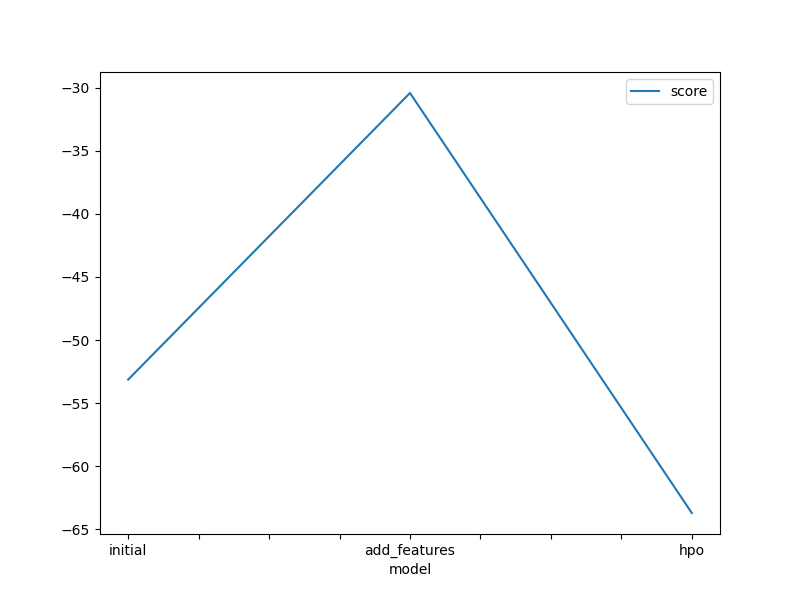
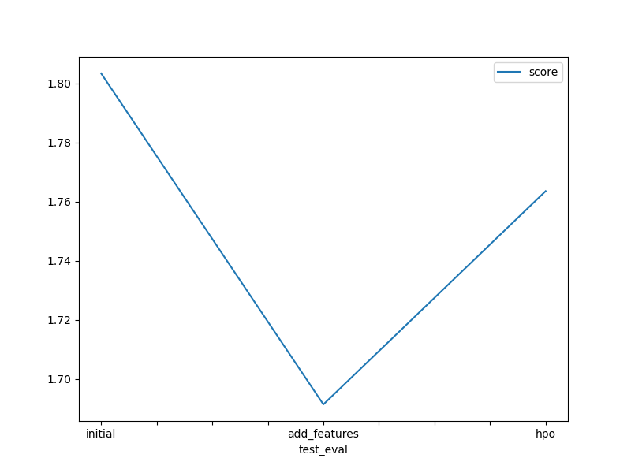

# Report: Predict Bike Sharing Demand with AutoGluon Solution
#### NAME HERE

## Initial Training
### What did you realize when you tried to submit your predictions? What changes were needed to the output of the predictor to submit your results?
TODO: Fortunately, I didn't encounter any negative values. However, incase I would get count<0, I would make it all 0 since count cannot be negative.

### What was the top ranked model that performed?
TODO:  WeightedEnsemble_L3 was my top ranking model in all three cases.

## Exploratory data analysis and feature creation
### What did the exploratory analysis find and how did you add additional features?
TODO: I realised that season, weather were being considered as integers since we could see intermediate decimal values in the x-axis of their histograms. I converted it to categorical and added additional feature like hour, month by extracting it from datetime.

### How much better did your model preform after adding additional features and why do you think that is?
TODO: My model performed much better in training dataset..however, it wasn't that good on the test one. A possible reason could be overfitting on the training dataset even though it trained for the same time due to the better features.

## Hyper parameter tuning
### How much better did your model preform after trying different hyper parameters?
TODO: The model performed slightly better than the base_model with different hyper parameter tuning. A big constraint was the disk and memory space I had. So, I restrained the num_trails so as to balance the low memory avaialable.

### If you were given more time with this dataset, where do you think you would spend more time?
TODO: I would spend it in better data preprocessing since we saw addition of just one feature improved the model perfomance so much. I would do PCA to get better attributes with more variation. I would also spend time in determing the training duration so that the modeldoesn't extend till overfitting case.

### Create a table with the models you ran, the hyperparameters modified, and the kaggle score.
|model|learning_rate|num_estimators|max_leaf_nodes|score|
|--|--|--|--|--|
|initial|0.05|300|15000|1.80338|
|add_features|0.05|300|15000|1.69133|
|hpo|0.05|153|15000|1.76353|

### Create a line plot showing the top model score for the three (or more) training runs during the project.

TODO: Replace the image below with your own.

### Create a line plot showing the top kaggle score for the three (or more) prediction submissions during the project.

TODO: Replace the image below with your own.

## Summary
TODO: I had not submitted models from my jupyter notebook via the Kaggle API before so it was very interesting to do that. I had faced permission issues initially while creating kaggle.json since I couldn't access root. I was able to save in my home directory and it worked well. The base and new features model were easy to train and it was interesting seeing the effect of overfitting. It was difficult getting the exact hyperparameters of the models like the learning_rate, num_estimators since the best models were stacked and had different hyperparameters. After some thinking, I decided to take the second/base level models of these stacked models to consider the hyperparamter. 
At the end, I wished to train the hpo model one last time to see if the results varied but I have limited space. Overall, I am satisfied with my submission.